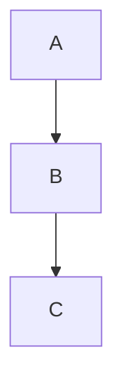

# Obsidian 마크다운 문법

Obsidian에서 쓸 수 있는 마크다운 문법 전체 안내. 표준 마크다운 + Obsidian 확장 문법을 함께 다룸.

---

## 텍스트 강조

| 문법                                                              | 결과                                        | 단축키                                                                 |
| --------------------------------------------------------------- | ----------------------------------------- | ------------------------------------------------------------------- |
| `**굵게**`                                                        | **굵게**                                    | `Ctrl+B` (기본 지정됨)                                                   |
| `*기울임*`                                                         | *기울임*                                     | `Ctrl+I` (기본 지정됨)                                                   |
| `***굵게+기울임***`                                                  | ***굵게+기울임***                              | 없음                                                                  |
| `~~취소선~~`                                                       | ~~취소선~~                                   | 기본 없음 — "Toggle strikethrough" 커맨드는 있어서 Settings→Hotkeys에서 직접 지정 가능 |
| `==하이라이트==`                                                     | ==하이라이트==                                 | 기본 없음 — "Toggle highlight" 커맨드는 있어서 직접 지정 가능                        |
| `<u>밑줄</u>`                                                     | <u>밑줄</u> (마크다운엔 밑줄 문법이 없어서 HTML 태그 사용)   | 기본 없음. 관련 커맨드가 있으면 Hotkeys에서 검색해 지정                                 |
| `` `인라인 코드` ``                                                  | `인라인 코드`                                  | 기본 없음 — "Toggle code" 커맨드는 있어서 직접 지정 가능                             |
| `<span style="color:red">색상</span>`                             | <span style="color:red">색이 입혀진 텍스트</span> | 없음 — 색상 지정은 기본 커맨드 자체가 없어서 Templater로 직접 만들어야 함 (아래 참고)             |
| `> [!note]- 제목` 또는 `<details><summary>제목</summary>내용</details>` | 토글(접기/펴기)                                 | 없음                                                                  |

색상·HTML 관련 자세한 문법·기법은 [[Obsidian 유용한 HTML 기법]] 참고.

### 색상 등 기본 커맨드 없는 기능을 단축키로 쓰기
Obsidian 자체엔 이런 커맨드가 없어서 Settings→Hotkeys만으로는 안 되지만, Templater로 이미 만들어 둠:

|템플릿|동작|
|---|---|
|`6. Templates/텍스트 색상 강조.md`|선택 영역을 빨간색 span으로 감쌈|
|`6. Templates/배경색 강조.md`|선택 영역을 노란색 배경 span으로 감쌈|
|`6. Templates/토글.md`|선택 영역을 `<details>` 토글로 감싸고 제목을 입력받음|

마지막 연결 단계만 Obsidian 안에서 직접 해야 함: 설정 → Hotkeys → "Templater: Insert 6. Templates/[템플릿 이름]" 커맨드를 각각 검색 → 원하는 단축키 지정. 다른 색이 필요하면 같은 폴더에 템플릿을 복사해서 색만 바꾸고 `enabled_templates_hotkeys`에 경로를 추가하면 됨 (상세 규칙은 [[6. Templates/CLAUDE]] 참고)

## 제목
```
# 제목1
## 제목2
### 제목3
#### 제목4
```
- 제목1(H1)은 보통 노트 제목과 겹치므로 본문에서는 제목2부터 시작하는 경우가 많음

## 목록
```
- 불릿
  - 중첩 불릿 (탭/2칸 들여쓰기)
1. 번호 목록
2. 번호 목록
- [ ] 할 일 (미완료)
- [x] 할 일 (완료)
```

## 링크

|문법|설명|
|---|---|
|`[[노트 이름]]`|내부 링크|
|`[[노트 이름\|표시 텍스트]]`|별칭 링크 (표시 텍스트만 다르게, 실제 링크 대상은 유지)|
|`[[노트 이름#제목]]`|노트 안 특정 제목으로 링크|
|`[[노트 이름^블록ID]]`|노트 안 특정 블록으로 링크 (블록 끝에 `^블록ID` 붙여서 지정)|
|`[텍스트](URL)`|외부 링크|
|`[[노트 이름]]` 뒤에 다른 폴더 동명 파일 있으면|같은 폴더 파일을 우선 연결, 모호하면 경로 명시: `[[폴더/노트 이름]]`|

## 임베드
```
![[노트 이름]]              # 노트 전체 임베드
![[노트 이름#제목]]          # 특정 섹션만 임베드
     # 마크다운 표준 이미지 문법
![[이미지.png]]              # Obsidian 임베드 문법 (권장)
![[이미지.png|300]]          # 너비 300px로 리사이즈
![[문서.pdf#page=3]]         # PDF 특정 페이지 임베드
```

## 코드 블록
````
```python
print("코드 하이라이팅 언어 지정 가능")
```
````
- ` ``` ` 뒤에 언어명(python, js, c, bash 등) 붙이면 문법 강조

## 표
```
|헤더1|헤더2|
|---|---|
|내용|내용|
```

정렬은 2번째 줄(구분선)에 콜론(`:`)을 어디에 붙이느냐로 결정한다 — 콜론 위치가 곧 정렬 방향:

| 구분선 표기 | 정렬 |
| --- | --- |
| `---` | 기본값(왼쪽) |
| `:---` | 왼쪽 정렬 |
| `:---:` | 가운데 정렬 |
| `---:` | 오른쪽 정렬 |

열마다 다르게 지정 가능:
```
|이름|나이|점수|
|:---|:---:|---:|
|철수|20|95|
```
→ "이름" 열은 왼쪽, "나이" 열은 가운데, "점수" 열은 오른쪽 정렬로 렌더링됨

## 인용
```
> 인용문
> 여러 줄도 가능
>> 중첩 인용
```

## 콜아웃 (Obsidian 확장)
```
> [!note] 제목
> 내용

> [!warning]
> 경고 내용

> [!tip]- 접기 가능한 콜아웃
> 클릭해야 펼쳐짐
```
- 지원 타입: `note`, `abstract`, `info`, `tip`, `success`, `question`, `warning`, `failure`, `danger`, `bug`, `example`, `quote` 등
- 뒤에 `-` 붙이면 기본 접힘, `+` 붙이면 기본 펼침

## 구분선
```
---
```

## 각주
```
본문 중 각주[^1]

[^1]: 각주 내용은 노트 하단에
```

## 수식 (LaTeX, MathJax)
```
인라인: $E = mc^2$
블록:
$$
\sum_{i=1}^{n} i = \frac{n(n+1)}{2}
$$
```

## 다이어그램 (Mermaid)
````

````

## 태그
```
#태그
#상위태그/하위태그
```
- 프론트매터의 `tags:` 필드와는 별개로 본문 어디서나 `#태그` 형태로 삽입 가능

## 프론트매터 (YAML)
```yaml
---
tags: [태그1, 태그2]
created: 2026-08-20
status: in-progress
---
```
- 노트 최상단에만 위치. Dataview에서 메타데이터로 쿼리 가능

## 주석 (숨김 텍스트)
```
%%이 텍스트는 편집 모드에서만 보이고 렌더링 시 숨겨짐%%
```

## 기타
- `---`만 있는 줄: 구분선
- 줄 끝에 공백 2칸 또는 `\`: 줄바꿈 강제
- `<br>`: HTML 줄바꿈도 사용 가능 (Obsidian이 HTML 일부 허용)
